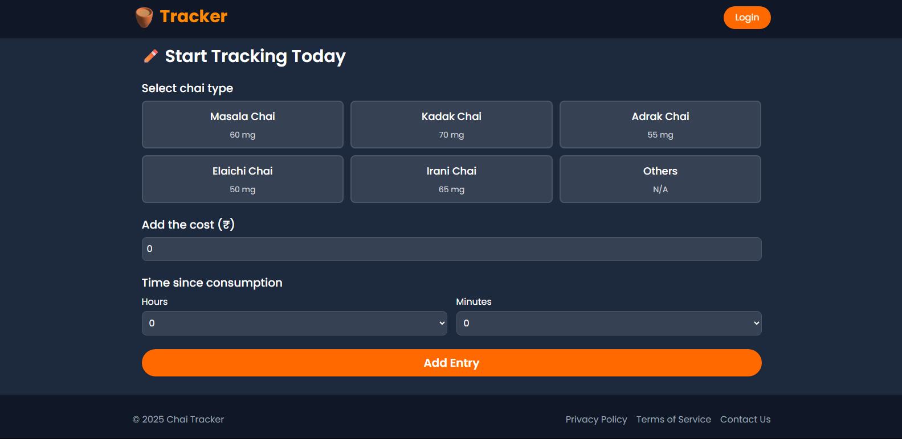
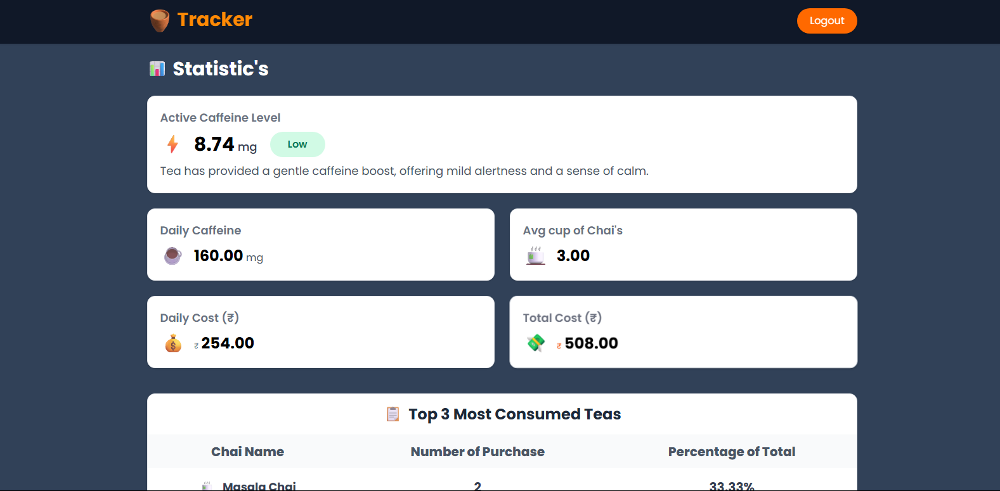
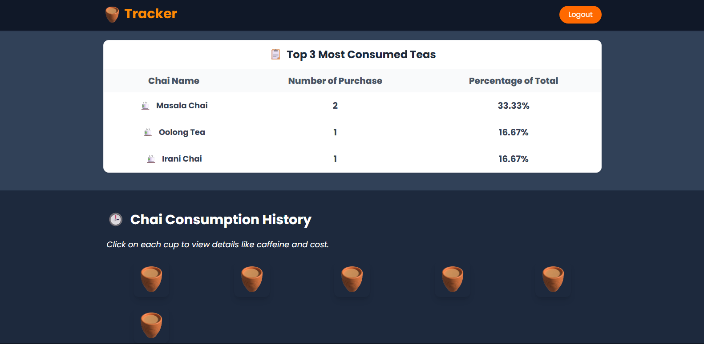
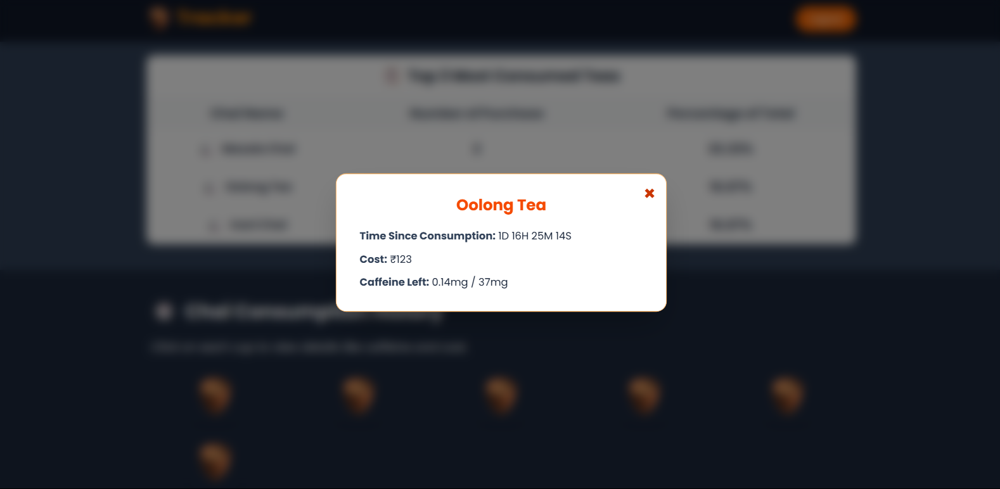
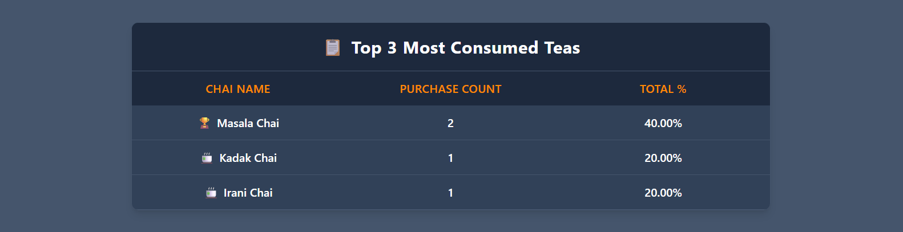
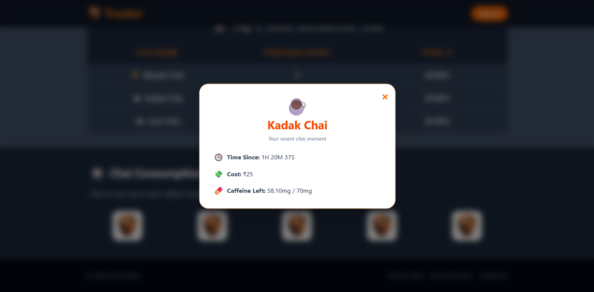

# ☕ Tracker

**Chai Tracker** is a fun and useful web app to track how much chai (tea) you've consumed and monitor your caffeine levels throughout the day.

🔗 [Live Demo](https://chai-tracker.vercel.app/)

## 📸 Screenshot's

## 🚀 Tech Stack

- **React** – Frontend Library
- **Tailwind CSS** – Utility-first styling
- **Firebase** – Authentication & Realtime Database

## 🔍 Features

- Add and log every chai you drink ☕
- Track your caffeine level dynamically
- Visual history with timestamps and chai types
- Modal popups for detailed chai info
- Mobile responsive and fast UI

## 🛠️ Getting Started

1. Clone the repo
2. Run `npm install`
3. Add Firebase config
4. Run `npm run dev`

---

> _"You learn more from errors than from code"_  
> — **Hitesh Choudhary**

---

Made with ❤️ for chai lovers!
