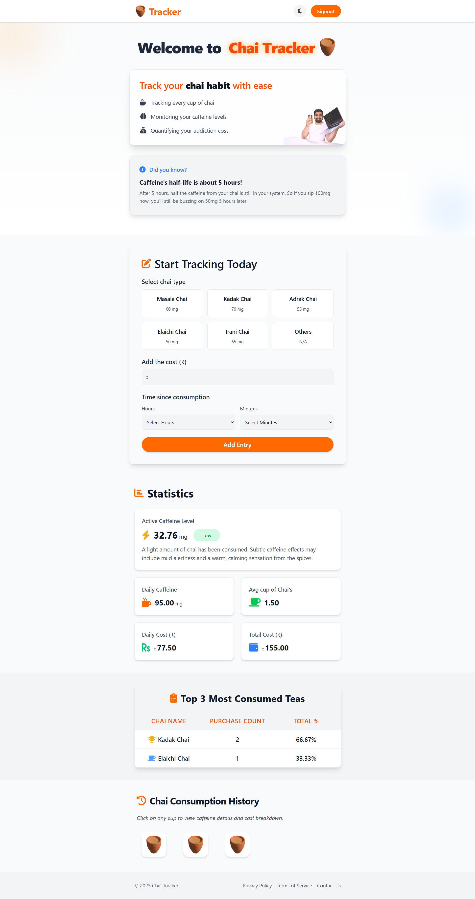
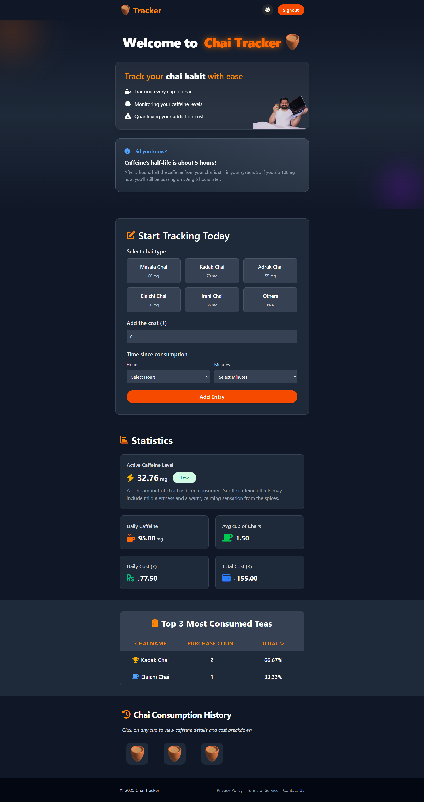

# Chai Tracker

**Sip. Track. Stay Balanced.**

Chai Tracker is a fun and useful web app designed to help you track how much chai (tea) you've consumed and monitor your caffeine levels throughout the day. It provides a simple, intuitive way to manage your daily intake and visualize your habits.

---

## 🔧 Features

-   **Add and log every chai you drink** ☕: Easily record each cup of tea you consume.
-   **Track your caffeine level dynamically**: See your caffeine intake update in real-time.
-   **Visual history with timestamps and chai types**: Review your past consumption with clear details.
-   **Modal popups for detailed chai info**: Get more insights into each logged entry.
-   **Mobile responsive and fast UI**: Enjoy a seamless experience on any device.
-   **Light and dark mode**: Customize your viewing preference.

---

## 🚀 Live Link

[**Launch Chai Tracker →**](https://chai-tracker.vercel.app/) https://chai-tracker.vercel.app/

---

## 🖼️ Screenshots





---

## 💡 Why I Built This

I built Chai Tracker to create a practical and enjoyable way for tea lovers to be more mindful of their consumption habits. The goal was to provide a straightforward tool that simplifies tracking, offers real-time insights into caffeine intake, and helps users maintain a balanced lifestyle without overcomplicating the process.

---

## 🧱 Challenges & Lessons

-   **Real-time Data Synchronization:** Integrating Firebase's real-time database to ensure immediate updates across the application for caffeine levels and history.
-   **Dynamic Caffeine Calculation:** Implementing a robust logic to accurately calculate and display dynamic caffeine levels based on consumption time and type.
-   **Intuitive UI/UX Design:** Crafting a clean, fast, and mobile-responsive interface that makes daily logging effortless and provides clear visual feedback.

---

## 🧠 What I Learned

-   The power of Firebase for rapid prototyping and building scalable, real-time web applications with minimal backend code.
-   The importance of a utility-first CSS framework like Tailwind CSS for efficient and consistent styling, especially for responsive design.
-   How a focused, single-purpose application can provide significant value and a great user experience through simplicity and clarity.

---

## 🗂️ Tech Stack

-   **React** – Frontend Library
-   **Tailwind CSS** – Utility-first styling
-   **Firebase** – Authentication & Realtime Database
-   Deployed with **Vercel**

---

## 📦 Future Enhancements

-   **Customizable Chai Types:** Allow users to define their own chai types with specific caffeine content.
-   **Daily/Weekly Reports:** Generate summaries of chai consumption and caffeine trends.
-   **Goal Setting:** Enable users to set daily caffeine limits and receive notifications.

---

## 📁 Project Setup

Clone the repo and run locally:

```bash
git clone https://github.com/the-ajay-panigrahi/chai-tracker.git
cd chai-tracker
npm install
# Add your Firebase configuration details
# (e.g., create a .env file and add firebase credentials as env variables)
npm run dev
```